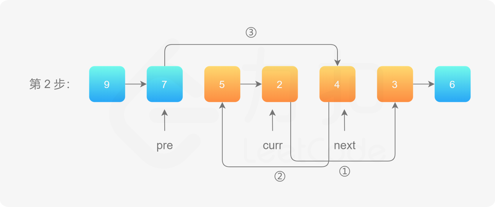

layout: page
title: "Linked List"
permalink: /linked-list/

## Linked List

### 1. Reverse a linked list

* Iterate

```javascript
export class Solution {

  /**
   * reverse
   *
   * @param head: n
   * @return: The new head of reversed linked list.
   */
  reverse(head) {
        let p = head;
        let pre = null;
        while (p) {
            let nxt = p.next;
            p.next = pre;
            pre = p;
            p = nxt;
        }
        return pre;
  }
}
```

* Recursion

```javascript
export class Solution {

  /**
   * reverse
   *
   * @param head: n
   * @return: The new head of reversed linked list.
   */
  reverse(head) {
    if (!head || !head.next) return head;
    const tail = this.reverse(head.next);
    head.next.next = head;
    head.next = null;
    return tail;
  }
}
```

### 2. Reverse a linked list from position `m` to `n`

* 遍历一次 图解





```javascript
/**
 * Definition for singly-linked list.
 * function ListNode(val, next) {
 *     this.val = (val===undefined ? 0 : val)
 *     this.next = (next===undefined ? null : next)
 * }
 */
/**
 * @param {ListNode} head
 * @param {number} left
 * @param {number} right
 * @return {ListNode}
 */
var reverseBetween = function(head, left, right) {
    let dummy = new ListNode(null, head);
    let pre = dummy;
    for (let i = 1; i < left; i++) {
        pre = pre.next;
    }
    let cur = pre.next;
    for (let i = left; i < right; i++) {
        let nxt = cur.next;
        cur.next = nxt.next;
        nxt.next = pre.next;
        pre.next = nxt;
    }
    return dummy.next;
};
```

### 3. Reverse Nodes in k-Group

```javascript
/**
 * Definition for singly-linked list.
 * function ListNode(val, next) {
 *     this.val = (val===undefined ? 0 : val)
 *     this.next = (next===undefined ? null : next)
 * }
 */
/**
 * @param {ListNode} head
 * @param {number} k
 * @return {ListNode}
 */
var reverseKGroup = function(head, k) {

    const reverse = function(head) {
        let pre = null;
        while (head) {
            let nxt = head.next;
            head.next = pre;
            pre = head;
            head = nxt;
        }
        return pre;
    }

    let dummy = new ListNode(null, head);
    let pre = end = dummy;
    while (end) {
        for (let i = 0; i < k && end; i++) {
            end = end.next;
        }
        if (!end) break;
        let start = pre.next;
        let nxt = end.next;
        end.next = null;
        pre.next = reverse(start);
        start.next = nxt;
        pre = start;
        end = pre;
    }
    return dummy.next;
};
```

### 4. Middle of the Linked List

```javascript
/**
 * Definition for singly-linked list.
 * function ListNode(val, next) {
 *     this.val = (val===undefined ? 0 : val)
 *     this.next = (next===undefined ? null : next)
 * }
 */
/**
 * @param {ListNode} head
 * @return {ListNode}
 */
var middleNode = function(head) {
    let fast = slow = head;
    while (fast && fast.next) {
        fast = fast.next.next;
        slow = slow.next;
    }
    return slow;
};
```

### 5. Linked List Cycle

```javascript
/**
 * Definition for singly-linked list.
 * function ListNode(val) {
 *     this.val = val;
 *     this.next = null;
 * }
 */

/**
 * @param {ListNode} head
 * @return {boolean}
 */
var hasCycle = function(head) {
    let i = j = head;
    while (i && j && j.next) {
        i = i.next;
        j = j.next.next;
        if (i == j) return true;
    }
    return false;
};
```

### 6. Linked List Cycle II


* 快慢指针，慢指针走过的距离为$a+b$，快指针走过的距离为$a+b+n(b+c)$，同时由于快指针走过的距离是慢指针的两倍$2(a+b)$，所以可以列出等式

$$2(a+b) = a+b+n(b+c)$$
$$a = (n - 1)(b + c) + c$$

* 所以可以先通过快慢指针找到汇合点，再将慢指针放回头结点，在同时将快指针和慢指针向后移动，最终会在环的开始处。

```javascript
/**
 * Definition for singly-linked list.
 * function ListNode(val) {
 *     this.val = val;
 *     this.next = null;
 * }
 */

/**
 * @param {ListNode} head
 * @return {ListNode}
 */
var detectCycle = function(head) {
   let slow = fast = head;
   while (fast && fast.next) {
       slow = slow.next;
       fast = fast.next.next;
       if (slow == fast) break;
   }
   if (!fast || !fast.next) return null;
   slow = head;
   while (slow != fast) {
       slow = slow.next;
       fast = fast.next;
   }
   return slow;
};
```

### 7. Sort List [链表排序](https://leetcode-cn.com/problems/sort-list/)

* 归并排序，子链表的合并使用合并两个有序链表的方法，依次合并两个长度为subLength的有序链表

```javascript
/**
 * Definition for singly-linked list.
 * function ListNode(val, next) {
 *     this.val = (val===undefined ? 0 : val)
 *     this.next = (next===undefined ? null : next)
 * }
 */
/**
 * @param {ListNode} head
 * @return {ListNode}
 */
var sortList = function(head) {
    
    var merged = function(head1, head2) {
        let dummy = new ListNode(0, null);
        let temp = dummy, 
            temp1 = head1, 
            temp2 = head2;
        while (temp1 && temp2) {
            if (temp1.val < temp2.val) {
                temp.next = temp1;
                temp1 = temp1.next;
            } else {
                temp.next = temp2;
                temp2 = temp2.next;
            }
            temp = temp.next;
        }
        if (temp1) 
            temp.next = temp1;
        if (temp2)
            temp.next = temp2;
        return dummy.next;
    }

    let len = 0;
    let cur = head;
    while (cur) {
        len++;
        cur = cur.next;
    }
    let dummy = new ListNode(0, head);
    for (let subLength = 1; subLength < len; subLength *= 2) {
        let pre = dummy, cur = dummy.next;
        while (cur) {
            let head1 = cur;
            for (let i = 1; i < subLength && cur && cur.next; i++) {
                cur = cur.next;
            }
            let head2 = cur.next;
            cur.next = null;
            cur = head2;
            for (let i = 1; i < subLength && cur && cur.next; i++) {
                cur = cur.next;
            }
            let nxt = null;
            if (cur) {
                nxt = cur.next;
                cur.next = null;
            }
            pre.next = merged(head1, head2);
            while (pre.next) {
                pre = pre.next;
            }
            cur = nxt;
        }
    }
    return dummy.next;
};
```

